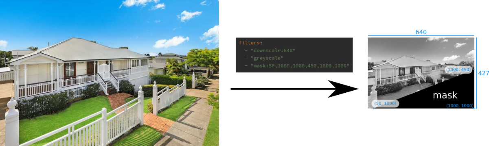
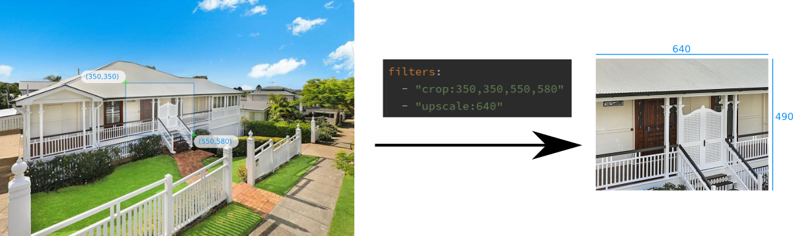

# Kaleidosnap

## Purpose

This program is an HTTP gateway for applying filters to cameras snapshot sources.

Requirements:
* Python 3.9 or Docker (previous versions of Python may be supported too).
* IP camera with an HTTP snapshot API.
  * Any HTTP accesible image is supported too.

## Config file
```yaml
# mask RGB color
mask_color: '#454545'
# image sources
sources:
  - id: cam1 
    url: "http://192.168.20.1/cgi-bin/api.cgi?cmd=Snap&channel=0&user=myuser&password=mypassword"
    filters:
      - "downscale:640"
      - "mask:0,0,250,250"
```
Image source attributes:
* `id`: Image ID. Will be the ID needed to reference the image in the HTTP Endpoint (`GET /source/{id}`).
* `url`: Image URL. The example is the URL of a Reolink IP Camera.
* `filters`: List of strings defining the filters applied to the image.

## HTTP API
* `GET /sources`: list of image source IDs.
* `GET /source/{id}`: get the actual image by source ID with filters applied.
  * If query param `passthrough=1` is set, the original image will be returned instead (without filters).

Note: authentication is not supported because this software is intended to be accessed from localhost or a restricted LAN.

## Image filters
The image filters are applied in the strict order defined in the config file.
* Downscale: `downscale:max_size`
  * `max_size` is the max size while keeping the aspect ratio.
  * Example: `downscale:640` with a 4:3 image will be downscaled to `640x480`
    * Note: if the image is smaller than 640, it won't be transformed.
* Upscale: `upscale:min_size`
  * `min_size` is the min size while keeping the aspect ratio.
  * Example: `upscale:1920` = a 16:9 image will be upscaled to `1920x1080`
    * Note: if the image is larger than 1920, it won't be transformed.
* Rotate: `rotate:degrees`
  * `degrees` = rotation degrees. Positive degrees are counterclockwise, negative degrees are clockwise.
  * Example: `degrees:-20` = image will be rotated 20 degress clockwise.
* Crop: `crop:x1,y1,x2,y2`
  * `x1,y1,x2,y2` are the coordinates of the two points defining a box.
    The coordinates are scaled from 0 to 1000 and independent from image size.
  * Example: `crop:250,250,750,750` = the crop box is centered with a size of half the height and width of original image.
* Mask: `mask:x1,y1,x2,y2,x3,y3,...`
  * This transform draws a black polygon to hide some portions of the image
  * `x1,y1,x2,y2` are the coordinates of the mask polygon.
    The coordinates are scaled from 0 to 1000 and independent from image size.
  * Polygon points must follow clockwise order.
* Greyscale: `greyscale`
  * Converts the image to greyscale.
  
### Filter examples
<a href="./doc/example1.png"></a>
<a href="./doc/example2.png"></a>

## Docker
A reference `docker-compose.yml` file is provided.

Default server port is 8080 and `config.yml` should be mounted on `/config.yml`.

## Licensing
Copyright 2020 Arturo Casal

Licensed under the Apache License, Version 2.0 (the "License");
you may not use this file except in compliance with the License.
You may obtain a copy of the License at

    http://www.apache.org/licenses/LICENSE-2.0

Unless required by applicable law or agreed to in writing, software
distributed under the License is distributed on an "AS IS" BASIS,
WITHOUT WARRANTIES OR CONDITIONS OF ANY KIND, either express or implied.
See the License for the specific language governing permissions and
limitations under the License.